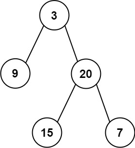

# Binary Trees

# Average of Levels in BT - 637

<aside>
💡

[3,9,20,null,null,15,7] → [3, 14.5, 11]



</aside>

- O(N)
    
    ```powershell
    results = []
    lev = deque([root])
    while lev:
    		values = []
    		for _ in range(len(lev)):
    				node = lev.popleft()
    				values.append(node.val)
    				if node.left: lev.append(node.left)
    				if node.right: lev.append(node.right)
    		results.append((sum(values)/len(values))
    return results
    ```
    

# Minimum depth of BT

<aside>
💡

[3,9,20,null,null,15,7]→2


</aside>

- Sol
    
    ```powershell
    if not root:
        return 0
    queue = deque([(root, 1)])
    while queue:
        node, level = queue.popleft()
        if not node.left and not node.right:
            return level
        if node.left: queue.append((node.left, level+1))
        if node.right: queue.append((node.right, level+1))
    return 0
    ```
    

# Maximum depth of BT - 104

<aside>
💡

[3,9,20,null,null,15,7]→3

</aside>

- My sol (ineff)
    
    ```powershell
    if not root:
        return 0
    ans = []
    maxdepth = 1
    level = deque([(root, maxdepth)])
    def find(level):
        while level:
            node, maxdp = level.pop()
            if not node.left and not node.right:
                ans.append(maxdp)
            if node.left:
                level.append((node.left, maxdp+1))
                find(level)
            if node.right:
                level.append((node.right, maxdp+1))
                find(level)
        return ans.append(0)
    find(level)
    return max(ans)
    ```
    
- Actual Sol - O(N)
    
    ```powershell
    if not root:
        return 0
    queue = deque([(root, 1)])
    while queue:
        node, level = queue.popleft()
        if node.left: queue.append((node.left, level+1))
        if node.right: queue.append((node.right, level+1))
    return level
    ```
    
- 1 line/ recursive O(N)
    
    ```powershell
    if not root:
        return 0
    return max(self.maxDepth(root.left), self.maxDepth(root.right))+1
    ```
    

# Max/Min node in BT

NOTE: BT is not in order like in BST (like left=low, right=high)

- Sol
    
    ```powershell
    queue = deque([root])
    max_node = 0
    min_node = float('inf')
    while queue:
    		node = queue.popleft()
    		if node.left: queue.append(node.left)
    		if node.right: queue.append(node.right)
    		if node.val > max_node:
    				max_node = node.val
    		if node.val < min_node:
    				min_node = node.val
    return max_node, min_node
    ```
    

# BT level order traversal - 102

<aside>
💡

[3,9,20,null,null,15,7] → [[3], [9,20],[15,7]]

</aside>

- O(N)/O(N)
    
    ```powershell
    if not root:
        return []
    order = []
    queue = deque([root])
    while queue:
        level =[]
        for _ in range(len(queue)):
            node = queue.popleft()
            if node.left: queue.append(node.left)
            if node.right: queue.append(node.right)
            level.append(node.val)
        order.append(level)
    return order
    ```
    

# Same tree - 100

<aside>
💡

p=[1,2,3],q=[1,2,3] → True

p=[1,2], q=[1,null,2] → False

</aside>

- O(N)/O(N)
    
    ```powershell
    queue = deque([(p,q)])
    while queue:
        node1, node2 = queue.popleft()
        if not node1 and not node2:
            continue
        if None in [node1,node2] or node1.val!=node2.val:
            return False
        queue.append((node1.left, node2.left))
        queue.append((node1.right, node2.right))
    return True
    ```
    

# Path sum - 112

<aside>
💡

root=[1,2,3], target = 5 → False


`root = [5,4,8,11,null,13,4,7,2,null,null,null,1], targetSum = 22 -> True`


</aside>

- Sol
    
    ```powershell
    if not root:
        return False
    queue = deque([(root, root.val)])
    sum =[]
    while queue:
        node, sum = queue.pop()
        if not node.left and not node.right:
            if sum == targetSum:
                return True
            continue
        if node.left: 
            queue.append((node.left, sum+node.left.val))
        if node.right: 
            queue.append((node.right, sum+node.right.val))
    return False
    ```
    

# Diameter of a BT - 543