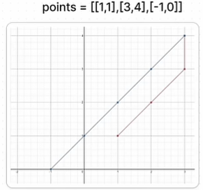

# Arrays

Number: 16

# Contains duplicate inputs - 217

<aside>
💡

1,2,3,1 → FALSE

1,2,3 → TRUE

</aside>

Sets: One of the 4 built-in datatypes (List, Tuples, Dicts)

→ Unordered  → Unchangable → Heterogeneous → Unique

→ Implemented as hashtable: O(1) for lookup/ins/del 

→ Empty set can’t be created like {} , creates dict unless values are present

→ Have to store the set version seperately eg: arr1 = set(arr)

→ not indexable so arr1[0] can’t happen

- HCed - (O(n log n) for sort + O(n) for bo)
    
    ```python
    arr.sort()
    for i in range(len(arr)-1): #default with 0
    	if arr[i]==arr[i+1]:
    		print("TRUE")
    		break
    else:	
    	print("FALSE")
    	
    # for–else in py
    # for item in something:
    #     if condition:
    #         break
    # else:
    ```
    
- Best Sol -  O(n)
    
    ```python
    arr=[1,2,2,3]
    if(len(set(arr))==len(arr)):
        print("False")
    else:
        print("True")
    ```
    

# Missing number - 268

<aside>
💡

0,1,3 → 2

0,1 → 2  #logical edge case

</aside>

O(1) for len and object range creation
O(n) for sum

- HCed - O(n log n)
    
    ```python
    arr.sort()
    
    for i in range(len(arr)):
        if arr[i] != i:
            print(i)
            break
    else:
        print(len(arr))
    ```
    
- Best Sol 1 - O(n)
    
    ```python
    
    return sum(range(len(arr)+1)) - sum(arr)
    #or (with set)
    arr = [0,1]
    s=set(arr) #O(n)
    for i in range(len(arr)+1):
        if i not in s: #O(1)
            print(i)
    ```
    
- Weird XOR one - O(n)
    
    ```python
    arr=[0,1] #example
    xor = len(arr) # 2
        for i, num in enumerate(nums):
            xor ^= i ^ num # 2 ^ 0 ^ 0 ^ 1 ^ 1 => 2 ^ 0 ^ 0 -> 2
        return xor
    ```
    

# Find all missing numbers - 448

<aside>
💡

1,2,3,2,2 → [4,5]

</aside>

- HCed Sol O(n^2)
    
    ```python
    n = len(arr)
    sol = []
    for i in range(1, n+1):
        if i not in arr: #O(n)
            sol.append(i)
    print(sol)
    ```
    
- Best Sol O(n)
    
    ```python
    n = len(arr)
    sol = []
    sets = set(arr)
    for i in range(1, n+1):
        if i not in sets: #O(1)
            sol.append(i)
    print(sol)
    ```
    

# 2 sum

<aside>
💡

2,7,11,15 & 9 → [0,1]

</aside>

They want the original indices, so better not to use sort. So, then, we can’t use 2 pointers.

Unsorted → Hash Map

d = {’a’:1, ‘b’:2, ‘c’:3}

→ key-value pairs → mutable → unordered, so not indexable → unique keys

It’s not prepopulated because what if the target is 4, then it will take 2 twice.

ins/lookup in hashmaps - O(1)

- Best Sol - O(n)
    
    ```python
    arr = [1,2,3,6,5,2]
    has = {}
    target = 8
    for i,n in enumerate(arr):
        diff = target - n
        if diff in has:
            print(i,has[diff])
        has[n] = i #key=n;value=i AND happens regardless of IF
    ```
    

but then if 2 same values in array, only one key, value (i) gets replaced by the latter one

so only one optimal solution pair

# How many nums are smaller than current - 1365

<aside>
💡

(8,4,2,1,2) → (4,3,1,0,1)

</aside>

based on sorted index but using a dist to avoid wrong answers due to duplicates

for example: (1,2,2,4,8)

in sorted: 8→4 is correct but for third 2 → 2 is not correct

can’t use set: index changes

dist: index stays same as values and index 2 gets skipped as 2 is duplicated in 1 and 2 and then value for key 2 is 1, so both 1. ## dict uses [] except for empty {}

                                                        **.sort()** VS **sorted=sorted()**

| **Feature** | **`.sort()` Method** | **`sorted()` Function** |
| --- | --- | --- |
| **Action** | Sorts the original list **in-place** (mutates the list). | Creates and returns a **new** sorted list. |
| **Return Value** | Returns `None`. | Returns a `list` containing all sorted elements. |
| **Usable On** | **Only on `list`s** (it is a list method). | **Any iterable** (lists, tuples, strings, dictionaries, sets, etc.). |
| **Memory** | More memory-efficient as it does not create a new object. | Less memory-efficient as it creates a copy of the iterable. |
- Best Sol - O(n log n + 2n) → O(n log n)
    
    ```python
    arr = [8,1,2,2,3]
    sorc = sorted(arr)
    dist = {}
    for i, n in enumerate(sorc):
        if n not in dist:
            dist[n]=i
    ret=[]
    for num in arr:
        ret.append(dist[num])
    print(ret)
    ```
    

Look at 34:26 for O(n) later

# Minimum Time visiting all points - 1266

each x,y,diag → 1 sec

<aside>
💡

[[1,1],[3,4],[-1,0]] → 7



</aside>

Concept: Max distance from either x or y from target, whichever it is, the max is the _shortest_ secs required to go to next point.

- Best Sol O(n) - if from 1st
    
    ```python
    points = [[1,1],[3,4],[-1,0]]
    res = 0
    x1, y1 = points.pop() #last one
    while points:
        x2, y2 = points.pop()
        res += max(abs(x2-x1), abs(y2-y1))
        x1, y1 = x2, y2
    print(res)
    ```
    
- Best Sol - if from (0,0)
    
    ```python
    points = [[1,1],[3,4],[-1,0]]
    res = 0
    nodiag=0
    x1, y1 = 0,0 #changes 
    while points:
        x2, y2 = points.pop()
        res += max(abs(x2-x1), abs(y2-y1))
        x1, y1 = x2, y2
    print(res, nodiag)
    ```
    

If no diag, add abs diff of ever point from previous: ((abs(y2-y1)+abs(x2-x1))

# Spiral Matrix - 54

<aside>
💡

matrix = [[1,2,3],[4,5,6],[7,8,9]] → [1,2,3,6,9,8,7,4,5]


</aside>

- O(n^2)
    
    ```python
    arr = [
        [1,  2,  3,  4,  5],
        [6,  7,  8,  9, 10],
        [11, 12, 13, 14, 15],
        [16, 17, 18, 19, 20],
        [21, 22, 23, 24, 25]
    ]
    ret = []
    
    while arr and arr[0]:
    			res+=(arr.pop(0))
    			if arr and arr[0]:
    						for row in arr:
    								res.append(row.pop())
    			if arr and arr[0]:
    						res+=(arr.pop()[::-1])
    			if arr and arr[0]:
    						for row in arr[::-1]:
    								res.append(row.pop(0))
    return res
    ```
    

# Number of Islands - 200

<aside>
💡

Input: grid = [
  ["1","1","0","0","0"],
  ["1","1","0","0","0"],
  ["0","0","1","0","0"],
  ["0","0","0","1","1"]
]
Output: 3  //islands not connected diagonally; seperate

</aside>

- O(RC)
    
    ```python
    from collections import deque
    
    grid = [
      ["1","1","0","0","0"],
      ["1","1","0","0","0"],
      ["0","0","1","0","0"],
      ["0","0","0","1","1"]
    ]
    
    num = 0
    visits = set()
    rows = len(grid)
    cols = len(grid[0])
    
    def bfs(r,c):
        q = deque()
        visits.add((r,c))
        q.append((r,c))
    
        while q:
            ro,co = q.popleft()
            directions =[[0,1],[1,0],[0,-1],[-1,0]]
            for rx,cx in directions:
                nr,nc =ro+rx, co+cx #new values
                if (0<=nr<rows and 0<=nc<cols and (r,c) not in visits and grid[r][c]=='1'): #string 1 and index in visits (not val)
                    visits.add((r,c))
                    q.append((r,c))        
    
    for r in range(rows):
        for c in range(cols):
            if grid[r][c]=='1' and (r,c) not in visits:
                bfs(r,c)
                num+=1
    
    print(num)
    ```
    

# Max Profit to buy/sell stocks - 121

<aside>
💡

[9,8,4,3] → 0

[1,2,3,9,8] → 8

</aside>

2 pointers in same direction. 1st point will pinpoint like best buy time (smallest), 2nd will iterate through to find the max diff to find the best sell time (largest)

- O(n)
    
    ```python
    arr =[7,1,5,3,6,4]
    l = 0
    r = 1
    maxp = 0
    while r != len(arr):
        if (arr[l]<arr[r]):
            prof = arr[r]-arr[l]
            maxp = max(maxp, prof)
        else:
            l = r
        r+=1
    print(maxp)
    ```
    

# Sorted Array Squared - 977

<aside>
💡

[-7,-2,1,3,4] → [1,4,9,16,49]

</aside>

- O(n logn) //due to sort
    
    ```python
    arr =[-7,-2,1,3,4]
    new =[]
    for num in arr:
        new.append(num**2)
    print(sorted(new))
    ```
    

append to deque = O(1)

- O(n)
    
    ```python
    from collections import deque
    arr = [-7,-5,0,1,3,5]
    d = deque()
    l, r = 0, (len(arr)-1)
    while l<=r:
        if (abs(arr[l])>abs(arr[r])):
            d.appendleft(arr[l]**2)
            l+=1
        else:
            d.appendleft(arr[r]**2)
            r-=1
    print(d)
    ```
    

# 2 Sum (Part II) - 167

sorted array this time → 2 pointers is better for sc

<aside>
💡

2,7,11,13 → [1,2]

</aside>

- O(n) - SC if hash
    
    ```python
    arr =[2,7,11,13]
    target = 9
    hash={}
    ans = []
    for i,n in enumerate(arr):
        diff = target - n
        if diff in hash:
            ans.append(hash[diff]+1)
            ans.append(i+1)
            print(ans)
        hash[n]=i
    ```
    
- O(1) - SC if 2p
    
    ```python
    arr =[2,7,11,13]
    target = 9
    l = 0
    r = len(arr)-1
    while l<=r: # = is for cases like 14 (7+7)
        check = arr[l]+arr[r]
        if check == target:
            print(l+1,r+1)
            break
        elif check < target:
            l+=1
        else:
            r-=1
    ```
    

# 3 Sum - 15

<aside>
💡

[-1,0,1,2,-1,-4] → [1 -1 2],[-1 0 1]

[0,0,0] → [0,0,0]

</aside>

- Sol
    
    ```python
    dup = [0,0,0]
    numbs = sorted(nums)
    res= []
    for i,num in enumerate(numbs):
        if i>0 and numbs[i]==numbs[i-1]:
            continue
        neg = 0 - num
        l = i+1
        r = len(nums)-1
        while l<r:
            cmp = numbs[l]+numbs[r]
            if cmp==neg:
                res.append([numbs[i],numbs[l],numbs[r]])
                while l < r and numbs[l] == numbs[l + 1]:
                    l += 1
                while l < r and numbs[r] == numbs[r - 1]:
                    r -= 1
                l += 1
                r -= 1
            elif cmp>neg:
                r-=1
            else:
                l+=1
    return res        
    ```
    

# Longest Mountain Array - 845

<aside>
💡

[2,1,4,7,3,2,5] → 5 i.e. [1,4,7,3,2]

</aside>

- Sol
    
    ```jsx
    res = 0
    for i in range(1, len(arr)-1):
        if (arr[i-1]<arr[i]>arr[i+1]):
            l=r=i
            while l > 0 and arr[l]>arr[l-1]:
                l-=1
            while r < len(arr)-1 and arr[r]>arr[r+1]:
                r+=1
            res = max(res, r-l+1)
    return res
    ```
    

# Contains Nearby Duplicate II - 219

<aside>
💡

[1,2,3,1], k=3→True

</aside>

- Sol (O(n) - TC & O(k) - SC for k sized set
    
    ```powershell
    window = set()
    for i, num in enumerate(nums):
    		if num in window:
    				return True
    		window.add(num)
    		if len(window) > k:
    				window.remove(nums[i-k])
    return False
    ```
    

# Minimum Absolute Difference - 1200

<aside>
💡

[4,2,1,3] → [[1,2],[2,3],[3,4]]

</aside>

- Sol
    
    ```powershell
    mini = flaot('inf')
    comb = []
    
    arr.sort()
    for i in range(1, len(arr)):
    		mini = min(mini, arr[i]-arr[i-1])
    for i in range(1, len(arr)):
    		if (arr[i]-arr[i-1]==mini):
    				comb.append([arr[i-1],arr[i]])
    return comb
    ```
    

# Minimum Size Subarray Sum - 209

<aside>
💡

7, [2,3,1,2,4,3] → 2 i.e. [3,4]

</aside>

- Sol - O(2n) TC
    
    ```powershell
    size = float('inf')
    l = 0
    total = 0
    for r in range(len(arr)):
    		total += arr[r]
    		while total >= target:
    				size = min(size, r-l+1)
    				total-=arr[l]
    				l+=1
    return size if size != float('inf') else 0
    		
    ```
    

Uses 2 pointer + sliding window combination

---

[lambda (1)](lambda%20(1)%203735159bfc1880889e34cff44d4ad216.md)

---